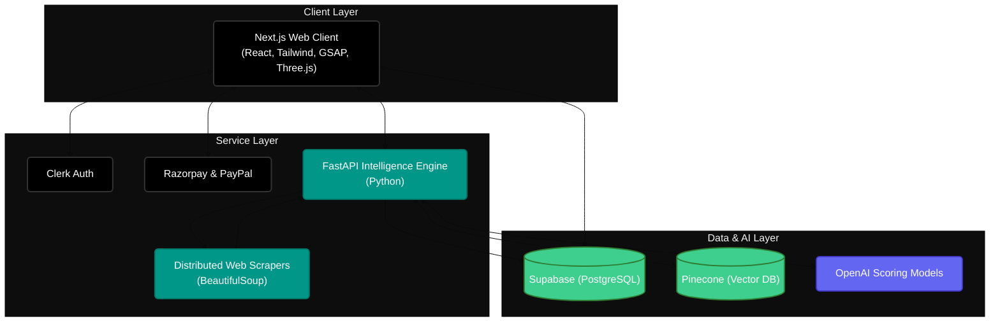

[](https://nextjs.org/)
[](https://fastapi.tiangolo.com/)
[](https://supabase.com/)
[](https://www.pinecone.io/)

# 📡 RADAR

RADAR is a distributed intelligence gathering and AI scoring pipeline. It aggregates data from 50+ disparate sources, processes it through an LLM-powered evaluation engine, and presents high-fidelity, actionable intelligence via a high-performance React frontend.

This repository demonstrates my capability to build and scale **distributed systems**, handle **complex data pipelines**, and design **production-ready AI integrations**.

---

## 🏗️ System Architecture

RADAR is built on a decoupled microservices architecture to ensure scalability and fault tolerance when scraping and processing high volumes of data.



---

## ⚡ Core Capabilities

- **Distributed Scraping Engine:** Orchestrates concurrent scraping tasks across 50+ unique data sources. Built with fault tolerance (retries, backoff) to handle unreliable target servers.
- **AI-Driven Scoring Pipeline:** Raw scraped data is passed to a Python (FastAPI) microservice, which leverages OpenAI models to extract entities, perform sentiment/relevance analysis, and generate a standardized confidence score.
- **Vector Search & Retrieval (RAG):** Processed intelligence is embedded and stored in Pinecone, enabling high-speed semantic search over the ingested dataset.
- **High-Performance Frontend:** A highly polished Next.js interface featuring complex 3D visualizations (Three.js/Fiber) and smooth scrolling animations (Lenis, GSAP, Framer Motion) to render data interactively without blocking the main thread.

---

## 🛠️ Technical Decisions & Trade-offs

### 1. Python (FastAPI) vs. Node.js for Backend
While the frontend is purely TypeScript/Next.js, the backend data pipeline is built in Python using FastAPI.
* **Why:** Python's ecosystem for web scraping (`BeautifulSoup`), data processing, and AI integrations (`openai`) is vastly superior and more stable than Node's. FastAPI provides async support out of the box, allowing high-throughput concurrent scraping without thread blocking.

### 2. Pinecone Vector DB + Supabase (PostgreSQL)
* **Why:** Supabase handles structured relational data (users, payments, standardized output), while Pinecone handles raw embeddings for semantic search. Splitting these workloads prevents the relational database from becoming a bottleneck during intensive vector similarity searches.

### 3. Decoupled Architecture via Docker
* **Why:** By containerizing the FastAPI scraping/scoring engine (`Dockerfile`, `docker-compose.yml`), it can be scaled independently of the Next.js frontend. If the scraping queue spikes, we can spin up more Python workers without wasting resources scaling the frontend servers.

### 4. Client-Side Rendering Optimization
* **Why:** The frontend uses WebGL (`@react-three/fiber`) and heavy animation libraries. To prevent performance degradation, animations are strictly offloaded to the GPU using CSS transforms and RequestAnimationFrame loops (via Lenis/GSAP), maintaining a smooth 60fps experience even when rendering complex data visualizations.

---

## 🚀 Getting Started

### Prerequisites
- Node.js 18+
- Python 3.10+
- Docker & Docker Compose
- API Keys: Supabase, Pinecone, OpenAI, Clerk

### Local Development Setup

**1. Clone the repository**
```bash
git clone https://github.com/SHAILESH-RS-UPADHYAY/radar.git
cd radar
```

**2. Start the Frontend (Next.js)**
```bash
npm install
# Set up .env.local with Supabase, Clerk, and API endpoints
npm run dev
```

**3. Start the Backend (FastAPI)**
```bash
# Set up .env with OpenAI and Pinecone keys
python -m venv venv
source venv/bin/activate  # On Windows: venv\Scripts\activate
pip install -r requirements.txt
uvicorn main:app --reload --port 8000
```

*Alternatively, run the backend via Docker:*
```bash
docker-compose up --build
```
